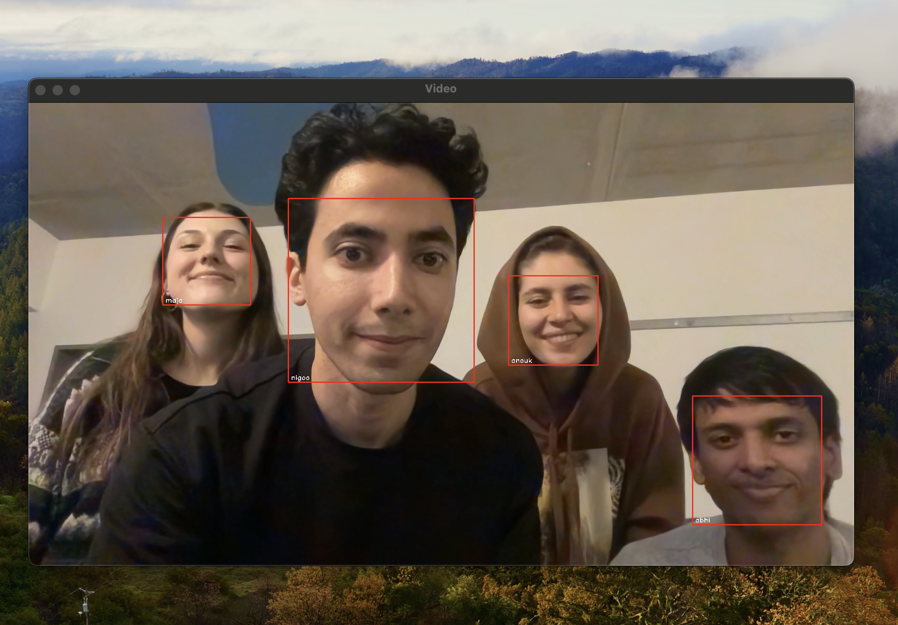

# Face Detection and Recognition Project



## Table of Contents

- [Introduction](#introduction)
- [Technologies Used](#technologies-used)
- [Installation](#installation)
- [Project Structure](#project-structure)
- [Usage](#usage)
- [Contributing](#contributing)
- [License](#license)

## Introduction

This project aims to provide a real-time face detection and recognition system. It captures face images, encodes them, and then uses these encodings for face detection and recognition.

## Technologies Used

- Python 3.x
- OpenCV
- Dlib
- NumPy
- Jupyter Notebook

## Installation

1. Clone the repository
    ```bash
    git clone https://github.com/your_username/Face_Detection_and_Recognition.git
    ```
2. Navigate to the project directory
    ```bash
    cd Face_Detection_and_Recognition
    ```
3. Install the required packages
    ```bash
    pip install -r requirements.txt
    ```

## Project Structure

```
Face_Detection_and_Recognition/
├── README.md
├── requirements.txt
├── captured_images/                  # Directory for storing captured face images
├── src/
│   ├── capturing_images.py           # Script for capturing face images using the camera
│   ├── encodings_creator.py          # Script for creating encodings from captured images
│   └── face_detection_and_verification.ipynb  # Jupyter Notebook for live face detection and recognition
└── data/
    └── known_faces.pkl               # Serialized encodings of known faces
```

### File Descriptions

- `capturing_images.py`: Captures face images using the camera and stores them in the `captured_images/` directory.
- `encodings_creator.py`: Reads images from the `captured_images/` directory, encodes the faces, and stores the encodings in `known_faces.pkl`.
- `face_detection_and_verification.ipynb`: Contains the main logic for real-time face detection and recognition. Uses the encodings stored in `known_faces.pkl`.
- `known_faces.pkl`: Serialized file that contains the encodings of known faces. Generated by `encodings_creator.py`.

## Usage

1. Run `capturing_images.py` to capture face images.
    ```bash
    python src/capturing_images.py
    ```
2. Run `encodings_creator.py` to create face encodings.
    ```bash
    python src/encodings_creator.py
    ```
3. Open `face_detection_and_verification.ipynb` in Jupyter Notebook and run the cells for live detection and recognition.

## Contributing

To contribute to this project, please fork the repository and submit a pull request.

## License

MIT License
```
